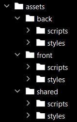

### 1. Récap des commandes pour créer un projet de 0 **(dans l'ordre)**


- Création du projet :

```
symfony new my_project_directory --version="5.4.*" --webapp
```


- Installation de Webpack :

```
composer require symfony/webpack-encore-bundle
```


- Initialisation de Yarn dans le projet :

```
yarn install
```


- Ajout de Webpack à Yarn :

```
yarn add @symfony/webpack-encore --dev
```


- Ajout du sass-loader :

```
yarn add sass-loader@^13.0.0 sass --dev
```


- Ajout du ts-loader (facultatif)

```
yarn add typescript ts-loader@^9.0.0 --dev
```


- Ajout de Bootstrap (possibilité de lui préciser une version avec "@5.3" après le bootstrap) :
```
yarn add bootstrap
```


- Ajout de Fontawsome :
```
yarn add @fortawesome/fontawesome-free
```


### 2. Configuration du Webpack :


Dans le fichier "webpackconfig.js", décommentez les lignes suivantes, selon que vous utilisez "scss" et/ou "ts" :

```js
// enables Sass/SCSS support
.enableSassLoader()

// uncomment if you use TypeScript
.enableTypeScriptLoader()
```


Suivre une "bonne" organisation des "assets" du projet :
Le principe est d'avoir un fichier de styles et un fichier de script pour le front (ce que voit l'utilisateur) et un pour le back (partie admin) :


```js
.addEntry('front_scripts', './assets/front/scripts/main.ts')
.addStyleEntry('front_styles', './assets/front/styles/main.scss')

.addEntry('back_scripts', './assets/back/scripts/main.ts')
.addStyleEntry('back_styles', './assets/back/styles/main.scss')
```

Exemple d'organisations des assets :




- La partie "shared" possède tout ce qui va être en commun aux deux parties, il n'est pas appelé dans le "webpackconfig.js" mais ses main.scss et main.ts seront appelés dans les "front/main.scss" et "back/main.scss", pareil pour les fichiers .ts
- Chaque dossier de chaque partie possède un "main.scss" ou un "main.ts" (selon qu'il se situe dans styles ou scripts)
- Dans le "shared/main.scss" on va lui ajouter directement bootstrap et fontawsome, afin de pouvoir l'utiliser partout :

```scss
@import '~bootstrap';

@import '~@fortawesome/fontawesome-free/scss/fontawesome';
@import '~@fortawesome/fontawesome-free/scss/brands';
@import '~@fortawesome/fontawesome-free/scss/regular';
@import '~@fortawesome/fontawesome-free/scss/solid';
```


(Attention en suivant cette arborescence il faudra retirer la ligne "enableStimulusController" dans le "webpackconfig.js"


Vérifier que tout fonctionne avec un :
```
yarn watch
```


### 3. Installation des bundles "importants" de Symfony :


- Ajout d'Alice bundle (générateur de fixtures) :
```
composer require --dev hautelook/alice-bundle
```


- Ajout de Knp Paginator (pagination automatique + filtre orderBy) :
```
composer require knplabs/knp-paginator-bundle
```


### 4. Configuration Symfony


Assurez-vous bien que dans le "config/services.yaml", la ligne suivante existe :

```yaml
App\Controller\:
    resource: '../src/Controller/'
    tags: ['controller.service_arguments']
```


Puis dans le dossier "config/routes" ajouter un fichier de nom : "annotations.yaml" avec ce contenu :

```yaml
controllers:
  resource: ../../src/Controller/
  type: annotation

kernel:
  resource: ../../src/Kernel.php
  type: annotation
```


