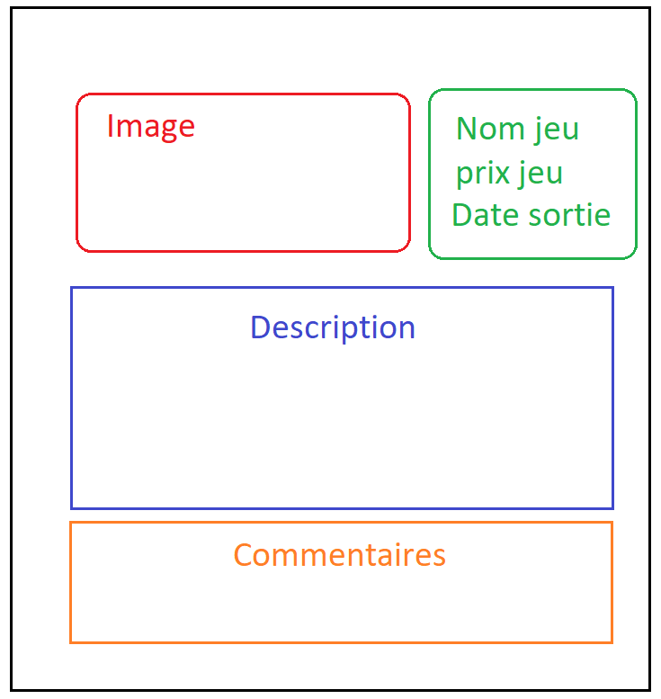

## Symfony - J2

Instant-Faking inspiré de : https://www.instant-gaming.com/en/

### 1. Faire la route de "show" d'un jeu

- Créer le controller adéquat avec un nom de route globale 
- Créer la route "show" qui prendra en paramètre un **slug** de jeu
- Cette route doit afficher un jeu sur une nouvelle page (url de celle-ci : "/jeu/overwatch")

#### 1.1 Faire le design de la page "show" d'un jeu 

Inspiré de : https://www.instant-gaming.com/en/8256-buy-smalland-survive-the-wilds-pc-game-steam/

Schéma de la page :

(PS : Une fois la page terminée, est-il possible d'optimiser le nombre de requêtes faites ?)

#### 1.2 Ajouter les jeux similaires

Après la zone de commentaires ajouter 9 jeux similaires (des jeux qui ont au moins une catégorie en commun avec le jeu de la page en cours) 
